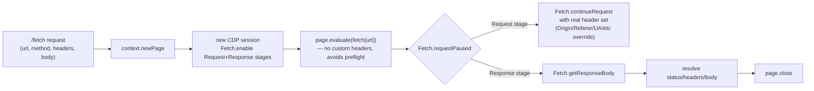
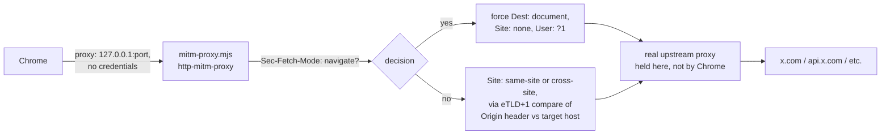

# Webview proxy & TLS sidecar architecture

Covers the webview-embedding system (`src/runtime/webview/`) and the TLS sidecar (`sidecar/`) — how a request for something like `x.com` gets from a real user's browser to the real upstream and back, what each layer does to it, and the bugs found/fixed getting it working. For the broader GlobalOS platform model (workspaces/processes/instances), see `docs/architecture.md`. For sidecar deployment mechanics, see `SETUP_SIDECAR.md`.

## Why this exists

A `.gapp` can embed a real external site (X, Instagram, YouTube) inside a GlobalOS window via an `<iframe>` proxied through our own domain (`{slug}.app.onetrueos.com`). The site being embedded doesn't know it's being proxied — it sees what looks like a normal browser request. Making that illusion hold up against Cloudflare/X's bot detection is most of the complexity here.

## End-to-end request flow

```mermaid
sequenceDiagram
    participant U as Real user's browser<br/>(iframe on {slug}.app.onetrueos.com)
    participant V as Vercel (Hono app)<br/>proxyWebviewRequest
    participant S as Sidecar (Hetzner)<br/>server.mjs
    participant M as Local MITM proxy<br/>mitm-proxy.mjs
    participant P as Residential proxy<br/>(Decodo)
    participant X as Upstream (x.com)

    U->>V: GET/POST to our domain
    Note over V: Rewrite Origin/Referer to bound domain<br/>strip Vercel/hop-by-hop headers<br/>set sec-ch-ua/UA to match Chrome profile
    V->>S: POST /fetch {url, method, headers, body}
    Note over S: New page + CDP session per call.<br/>Trigger fetch() with NO custom headers<br/>(avoids CORS preflight) — real headers<br/>applied via Fetch.continueRequest instead
    S->>M: Chrome's real network request
    Note over M: Correct Sec-Fetch-* (Chrome recomputes<br/>these from real context regardless of<br/>CDP overrides — fixed here instead)
    M->>P: forward (holds real proxy credentials —<br/>Chrome never sees them, avoids CDP/proxy-auth conflict)
    P->>X: request with residential exit IP
    X-->>P-->>M-->>S: response
    S-->>V: {status, headers, body}
    Note over V: Rewrite Set-Cookie, strip CSP/X-Frame-Options,<br/>inject intercept script into HTML
    V-->>U: response
```

## Why a sidecar at all

Vercel's Node runtime (undici) has a TLS fingerprint Cloudflare identifies as non-browser — even through a residential proxy, X deleted the `ct0` CSRF cookie and eventually blocked login outright. Two approaches were tried:

1. **TLS impersonation** (`tls-client`, Go) — mimics Chrome's TLS ClientHello without being Chrome. Worked for basic pages, broke on the login flow.
2. **Real Chrome** (current) — actually is Chrome, so the TLS/JA3/JA4 fingerprint is never a lie in the first place.

### Real Chrome vs. Chromium vs. headless

Determined empirically (see `SETUP_SIDECAR.md` for the full test matrix):

| Variant | Result |
|---|---|
| Real Chrome, headed | pass |
| Real Chrome, headless, default UA (`HeadlessChrome/...`) | blocked |
| Real Chrome, headless, `Headless` stripped from UA | pass |
| Playwright's bundled Chromium, any mode | blocked regardless of UA |

So: real Google Chrome is required (Chromium fails for reasons beyond headers — Widevine CDM presence and `navigator.userAgentData` brand list are suspects, not confirmed further), and headless is fine once the UA string doesn't contain `"Headless"` — no Xvfb needed.

## Sidecar internals: one page + CDP session per request



Why per-request pages instead of one shared page: the original design shared one page across all calls, correlating in-flight requests via a custom `x-sidecar-correlation-id` header injected into the trigger `fetch()`. That's broken — any custom header on a cross-origin `fetch()` forces a CORS preflight, and real upstreams don't grant permission for a made-up header, so the browser aborted the real request after the preflight was rejected. Per-request pages need no correlation at all.

Redirects are followed by the sidecar itself (`chromeFetch`'s loop), not by the in-page `fetch()` (which uses `redirect: 'manual'`) — this avoids ambiguity about which CDP event belongs to which hop.

## Bugs found and fixed this session

| # | Bug | Fix |
|---|---|---|
| 1 | `event.requestStage` isn't actually present on `Fetch.requestPaused` events in practice (contrary to what the CDP docs imply) | Detect response stage via `'responseStatusCode' in event` instead |
| 2 | Custom correlation header on the trigger `fetch()` forces a CORS preflight, which real upstreams reject, so the real request never fires | Per-request pages (no correlation needed) + zero custom headers on the trigger call |
| 3 | Every request hangs indefinitely once `PROXY_URL` (with credentials) is set, for any URL — not site-specific | Chrome/Playwright handles authenticated proxy credentials via its own internal CDP interception, which conflicts with our separate `Fetch.enable`. Fixed by never handing Chrome real credentials at all (see MITM section below) |
| 4 | `window.location`/`document.referrer` visible to the embedded site's own JS genuinely reflects our proxy subdomain, leaking into things like analytics payloads | `window.location` **cannot** be shimmed — confirmed empirically (`Cannot redefine property: origin`, real Chrome, non-configurable by design). `document.referrer` **can** (ordinary `Document.prototype` accessor) — shimmed. Outgoing `fetch`/XHR/`sendBeacon` bodies are also scanned and have the real origin/hostname replaced with the bound domain before the request leaves the browser |
| 5 | `Sec-Fetch-Site`/`Sec-Fetch-Dest` don't match what a real navigation/same-site request would show, no matter what's passed to `Fetch.continueRequest` | Chrome recomputes these from the *real* request context (a background `fetch()` from a never-navigated blank page) after CDP processing — confirmed by explicitly requesting `Sec-Fetch-Site: none` and getting `cross-site` back anyway, while `Sec-Fetch-Mode` *was* honored, producing an inconsistent (and more suspicious) combination. See "Sec-Fetch correction" below |

## Sec-Fetch correction & the MITM proxy (`sidecar/mitm-proxy.mjs`)

Real Chrome reference values, captured from a genuine browser session (not proxied):

| Request | Sec-Fetch-Dest | Sec-Fetch-Mode | Sec-Fetch-Site |
|---|---|---|---|
| Top-level nav to `x.com` | `document` | `navigate` | `none` |
| `api.x.com` call from x.com's own JS | `empty` | `cors` | `same-site` |
| `abs.twimg.com` asset (different registrable domain) | `empty` | `cors` | `cross-site` |

Our sidecar, since it never actually navigates (every request is a background `fetch()` from a blank page), produces `empty`/`cors`/`cross-site` for *everything*, including what's supposed to be the main document load. `Fetch.continueRequest` header overrides don't fix this — `Sec-Fetch-Site`/`Sec-Fetch-Dest` get silently recomputed by Chrome regardless.

Since no CDP-level fix exists, a local MITM proxy sits between Chrome and the real upstream to correct these headers after Chrome has already sent the request:



This also solves bug #3 for free: since the MITM proxy (a plain Node process) holds the real proxy credentials and forwards through `https-proxy-agent`/`http-proxy-agent`, Chrome only ever talks to a local, unauthenticated proxy and never engages its own internal proxy-auth handling.

**Status: working, verified.** The initial version failed every request with a generic Chrome `network error: Failed`, including against a real external HTTPS site. Root cause: `proxy.listen({ port: 0 })` with no explicit host resolved to IPv6-only (`::1`) on this system, while Chrome's proxy config connects via the literal IPv4 loopback address (`127.0.0.1`) — connection refused. Fixed by explicitly binding `host: '127.0.0.1'`. Verified against httpbin.org (main-doc-style request correctly shows `Dest: document, Mode: navigate, Site: none`; API-style requests correctly show `same-site` when the Origin's registrable domain matches the target, `cross-site` when it doesn't) and against the full real chain (Chrome → MITM → real residential proxy → x.com, 200 with real page content, ~250ms).

## What's still unresolved

The original symptom driving most of this session — X showing "Please use X.com or official X apps to proceed with log in/sign up" — has not been conclusively traced to one root cause. Several real, confirmed bugs were fixed along the way (CORS preflight hang, proxy-auth/CDP conflict, domain leaks into request bodies), and the Sec-Fetch-* mismatch (this section) is a strong remaining candidate, but it isn't verified yet because the MITM proxy integration itself isn't working. Next step once the MITM proxy is fixed: re-test the login flow and see whether the error clears up.
